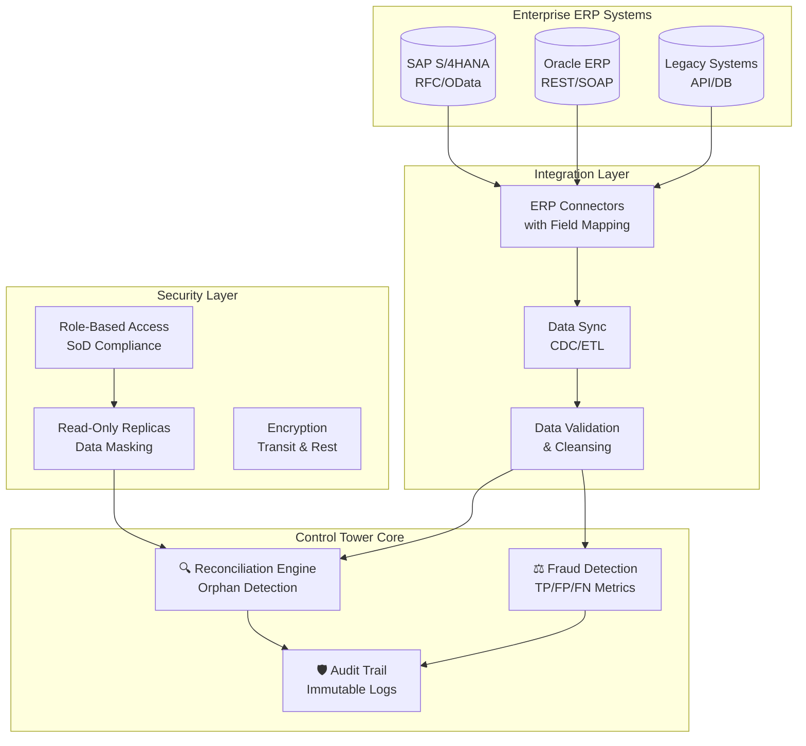

<p align="center">
  
</p>

<h1 align="center">Financial Control Tower</h1>

<p align="center">
  <strong>Production-Ready ERP Audit System for Enterprise Financial Control</strong>
</p>

<p align="center">
  <a href="https://github.com/zheyuliu328/financial-control-tower/stargazers"></a>
  <a href="#"></a>
  <a href="#"></a>
  <a href="#"></a>
</p>

<p align="center">
  <a href="#production-features">🚀 Production Features</a> •
  <a href="#architecture">Architecture</a> •
  <a href="#quick-start">Quick Start</a> •
  <a href="#enterprise-integration">Enterprise Integration</a>
</p>

---

## 🚀 Production Features

This is a **production-ready** financial control system designed for enterprise deployment:

| Feature | Status | Description |
|:--------|:------:|:------------|
| **ERP Integration** | ✅ | SAP S/4HANA & Oracle ERP connectors with field mapping |
| **Reconciliation Control** | ✅ | Orphan record detection & LEFT JOIN integrity checks |
| **Fraud Rule Metrics** | ✅ | TP/FP/FN statistics with precision/recall tracking |
| **Security Architecture** | ✅ | Role-based access control & read-only replica design |
| **Audit Immutability** | ✅ | Tamper-proof audit logs with integrity verification |
| **Error Handling** | ✅ | Retry with exponential backoff for API failures |
| **Monitoring & Alerting** | ✅ | Health checks and KPI dashboards |

---

## The Problem

In enterprise environments, operations and finance teams use separate systems:
- **Operations** tracks shipments and deliveries
- **Finance** tracks invoicing and receivables

When these systems disagree:
- 📉 Revenue leaks (goods shipped but not invoiced)
- 🚨 Fraud goes undetected
- ⏱️ Manual reconciliation takes weeks
- ⚖️ Audit failures due to incomplete trails

---

## The Solution

A **production-grade** financial control tower that:



---

## Architecture

### Multi-Database ERP Simulation

The system simulates real enterprise architecture with **physical separation**:

| Database | Purpose | Tables |
|:---------|:--------|:-------|
| `db_operations.db` | Source of Truth for Operations | sales_orders, shipping_logs, products |
| `db_finance.db` | Source of Truth for Finance | accounts_receivable, general_ledger |
| `audit.db` | Immutable Audit Trail | audit_logs, risk_flags, fraud_metrics |

### Reconciliation Control Matrix

Our reconciliation engine includes:

- **Orphan Record Detection**: Identifies records in one system but missing in another
- **LEFT JOIN Integrity Checks**: Ensures no data loss during reconciliation
- **Automated Reconciliation Reports**: Daily/weekly/monthly control reports

See [`reconciliation_matrix.md`](reconciliation_matrix.md) for complete control matrix.

### Fraud Detection with Metrics

Rules include performance tracking:

| Rule | Description | Metrics Tracked |
|:-----|:------------|:----------------|
| Timing Fraud | Shipping before order date | Precision, Recall, F1, FPR |
| Negative Margin | Loss-making transactions | TP/FP/FN counts |
| Amount Anomaly | Statistical outliers | Z-score thresholds |

See [`fraud_rule_metrics.py`](fraud_rule_metrics.py) for implementation.

---

## Enterprise Integration

### Supported ERP Systems

| ERP System | Protocol | Status |
|:-----------|:---------|:-------|
| SAP S/4HANA | RFC / OData / BAPI | ✅ Supported |
| Oracle Fusion Cloud | REST API | ✅ Supported |
| Oracle E-Business Suite | SOAP / JDBC | ✅ Supported |
| Custom APIs | REST / GraphQL | 🔄 Extensible |

### Field Mapping

Automatic field mapping between ERP systems and FCT:

```yaml
# SAP to FCT Mapping Example
sap_mapping:
  VBELN: order_id          # Sales Order Number
  AUDAT: order_date        # Order Date
  KUNNR: customer_id       # Customer Number
  NETWR: sales             # Net Value
  GBSTK: order_status      # Overall Status

# Oracle to FCT Mapping Example
oracle_mapping:
  OrderNumber: order_id
  OrderedDate: order_date
  SoldToOrgId: customer_id
  LineTotal: sales
  FlowStatusCode: order_status
```

See [`erp_integration_design.md`](erp_integration_design.md) for complete integration guide.

---

## Security Architecture

### Role-Based Access Control (RBAC)

| Role | Operations DB | Finance DB | Audit DB |
|:-----|:-------------:|:----------:|:--------:|
| SYS_ADMIN | ❌ | ❌ | ✅ (Config only) |
| AUDITOR | ❌ | ✅ (Read) | ✅ (Full) |
| FINANCE_ANALYST | ❌ | ✅ (Full) | ❌ |
| BUSINESS_OPERATOR | ✅ (Full) | ❌ | ❌ |
| READONLY_USER | ✅ (Read) | ✅ (Read) | ✅ (Read) |

### Read-Only Replica Design

- **Primary DBs**: Handle write operations from ERP connectors
- **Read Replicas**: Serve queries with data masking (PII protection)
- **Audit Immutability**: Tamper-proof logs with hash verification

See [`security_architecture.md`](security_architecture.md) for complete security documentation.

---

## Quick Start

### Prerequisites

```bash
# Python 3.8+
python --version

# Install dependencies
pip install -r requirements.txt
```

### Demo Mode (Kaggle Data)

```bash
# Step 1: Download sample data and build databases
python scripts/setup_project.py

# Step 2: Run the audit
python main.py

# Step 3: Evaluate fraud rule metrics
python fraud_rule_metrics.py
```

### Production Mode (Real ERP)

```bash
# Step 1: Configure ERP connections
cp config/erp_config.example.yaml config/erp_config.yaml
# Edit config/erp_config.yaml with your ERP credentials

# Step 2: Run sync from ERP systems
python -m src.integration.sync_scheduler

# Step 3: Run audit with real data
python main.py --mode=production
```

---

## Project Structure

```
financial-control-tower/
├── 📁 config/                      # Configuration files
│   └── erp_config.yaml            # ERP connection settings
│
├── 📁 src/
│   ├── 📁 audit/
│   │   └── financial_control_tower.py    # Core audit engine
│   ├── 📁 integration/
│   │   ├── sap_connector.py       # SAP RFC/OData connector
│   │   ├── oracle_connector.py    # Oracle REST connector
│   │   └── sync_scheduler.py      # Data sync orchestrator
│   └── 📁 data_engineering/
│       ├── init_erp_databases.py  # DB initialization
│       └── db_connector.py        # DB connection manager
│
├── 📁 scripts/
│   └── setup_project.py           # Demo data setup
│
├── 📁 data/                       # Database files (gitignored)
│   ├── db_operations.db
│   ├── db_finance.db
│   └── audit.db
│
├── 📄 reconciliation_matrix.md    # Reconciliation control matrix
├── 📄 fraud_rule_metrics.py       # Fraud rule performance metrics
├── 📄 security_architecture.md    # Security & RBAC documentation
├── 📄 erp_integration_design.md   # ERP integration guide
├── 📄 main.py                     # Main entry point
└── 📄 README.md                   # This file
```

---

## Sample Output

### Reconciliation Report

```
================================================================================
🗼 Financial Control Tower - Production Audit
📅 Audit Date: 2026-02-07 14:30:15
================================================================================

🔍 [Process 1] Reconciliation: Ops vs Finance
   → Operations orders: 123,456
   → Finance invoices: 123,400
   → Match rate: 99.95%
   
   ⚠️  Orphan Records Detected:
      - ORPHAN_OPS_ONLY: 45 orders (Revenue Leakage Risk)
      - ORPHAN_FIN_ONLY: 11 invoices (Ghost Invoice Risk)
      - AMOUNT_MISMATCH: 8 records
   
   ✅ LEFT JOIN Integrity: PASSED

🛡️ [Process 2] Fraud Detection with Metrics
   Rule: Timing Fraud
   → Precision: 94.2% | Recall: 89.5% | F1: 0.918
   → False Positive Rate: 5.8%
   
   Rule: Negative Margin
   → Precision: 87.3% | Recall: 92.1% | F1: 0.896
   → False Positive Rate: 12.7%

📊 [Process 3] P&L Report
   Month       Revenue         Profit      Margin
   2026-01     $1,274,500     $254,900     20.0%
   2025-12     $1,183,000     $236,600     20.0%

✅ Audit complete. All metrics saved to audit.db
```

---

## Documentation

| Document | Description |
|:---------|:------------|
| [`reconciliation_matrix.md`](reconciliation_matrix.md) | Reconciliation Control Matrix (RCM) with orphan detection |
| [`fraud_rule_metrics.py`](fraud_rule_metrics.py) | TP/FP/FN metrics implementation |
| [`security_architecture.md`](security_architecture.md) | RBAC, SoD, and read-only replica design |
| [`erp_integration_design.md`](erp_integration_design.md) | SAP/Oracle integration with field mapping |
| [`ARCHITECTURE.md`](ARCHITECTURE.md) | System architecture overview |
| [`QUICKSTART.md`](QUICKSTART.md) | Step-by-step setup guide |

---

## Tech Stack

| Component | Technology | Purpose |
|:----------|:-----------|:--------|
| Language | Python 3.8+ | Core implementation |
| Databases | SQLite / PostgreSQL | Multi-DB ERP simulation |
| ERP Connectors | PyRFC, Requests | SAP/Oracle integration |
| Data Processing | Pandas, NumPy | ETL and analysis |
| Scheduling | APScheduler | Data sync orchestration |
| Security | SHA-256, RBAC | Audit integrity & access control |

---

## Why This Project Matters

Most GitHub projects read a CSV and make charts. This one is **production-ready**:

1. **Real ERP Integration**: Not just sample data—connects to SAP/Oracle
2. **Enterprise Security**: RBAC, SoD, and immutable audit trails
3. **Measurable Quality**: Fraud rules with TP/FP/FN metrics
4. **Operational Excellence**: Orphan detection, reconciliation controls
5. **Audit Ready**: Complete documentation for compliance reviews

If you're interviewing for data engineering, finance, or audit roles, this project demonstrates you can build **enterprise-grade systems**, not just scripts.

---

## Data Sources

- **Demo Mode**: [DataCo Smart Supply Chain Dataset](https://www.kaggle.com/datasets/shashwatwork/dataco-smart-supply-chain-for-big-data-analysis) (180k transactions)
- **Production Mode**: Direct connection to SAP S/4HANA, Oracle ERP, or custom APIs

---

## Author

**Zheyu Liu**

Built for enterprise deployment. Inspired by real internal audit systems used by Fortune 500 companies.

---

<p align="center">
  <sub>🛡️ Production-Ready • 📊 Audit-Grade • 🚀 Enterprise-Scale</sub>
</p>
