## Financial Control Tower: ERP Audit System

This repo shows how to build a finance control tower on real supply‑chain data. It uses the real DataCo CSV (about 180k rows) and turns it into three SQLite databases that mimic a real ERP split: operations, finance, and audit. The main goal is to catch revenue leakage, timing fraud, and negative margin orders, and then print simple P&L and regional profit views in the terminal.

Here is the big picture:

```mermaid
graph TD
    subgraph "External World"
        RawData[("Raw Data (DataCo CSV)")]
    end

    subgraph "Enterprise ERP Simulation"
        OpsDB[("🗄️ Operations DB\n(Sales/Shipping)")]
        FinDB[("🗄️ Finance DB\n(GL/AR)")]
        AuditDB[("🛡️ Audit DB\n(Risk Logs)")]
    end

    subgraph "The Solution: Financial Control Tower"
        ETL[("⚙️ ETL Engine")]
        Recon[("🔍 Reconciliation Engine\n(Ops vs Finance)")]
        Compliance[("⚖️ Compliance Engine\n(Fraud Rules)")]
    end

    RawData -->|Init Script| OpsDB
    RawData -->|Init Script| FinDB
    OpsDB -->|Extract Orders| Recon
    FinDB -->|Extract AR| Recon
    OpsDB -->|Extract Logistics| Compliance
    Recon -->|Log Discrepancies| AuditDB
    Compliance -->|Log Risks| AuditDB
```

How it helps: the operations database represents what the business thinks happened, the finance database represents what the books say, and the audit database records gaps and red flags. The control tower compares operations and finance to find missing accounts receivable or amount mismatches, flags shipments that happen before the order date, and finds orders with negative profit. Everything runs as Python code using SQL queries on SQLite, and all findings are written into `audit.db`.

How to run it: first install the Python packages from `requirements.txt`. Then run `python scripts/setup_project.py` to download the DataCo dataset, place the CSV into `data/raw`, create the three databases and load the data. After that, run `python main.py` to execute reconciliation, compliance checks and P&L output. When it finishes, open `data/audit.db` with `sqlite3` or any GUI and inspect the `audit_logs` table.

About the data: the DataCo Smart Supply Chain dataset is a public Kaggle dataset with messy, realistic data. It includes odd dates, suspected fraud flags and negative margins. This project does not create fake rows or use random generators; it works directly on that dataset.

Code layout in simple words: `scripts/setup_project.py` is the one‑click setup script that downloads data and builds the databases. `src/data_engineering/init_erp_databases.py` takes the raw CSV and splits it into three SQLite databases with the right tables. `src/audit/financial_control_tower.py` is the core logic that runs reconciliation, timing checks, negative margin checks and prints the P&L and regional summaries. `main.py` is the entry point that checks the environment and starts the control tower. The file `docs/SQL_RECONCILIATION.md` explains the SQL reconciliation logic in plain SQL, step by step.

Why this matters: it shows how to move from a flat CSV file to a small, realistic multi‑database ERP‑style setup, how to use SQL joins to catch revenue leakage and data mismatches, how to detect simple fraud‑like patterns based on dates and margins, and how to write a repeatable audit log instead of just eyeballing a notebook chart.

How to extend it: if you want more rules, you can add extra checks in `audit_supply_chain_risks()` or new methods in `FinancialControlTower`. If you want richer reports, you can add queries in `generate_financial_statements()` or build a dashboard on top of the same databases.

Educational value: this repo is meant as a clear, end‑to‑end example for students and junior developers who want to talk about real finance and operations integration in interviews. It keeps the tools simple (Python and SQLite) but still shows realistic patterns like separate operations and finance stores, SQL‑driven reconciliation logic and an audit trail.

Author: Zheyu Liu.  
Date: 2026‑01‑07.  
Résumé tagline: Full‑Stack ERP Audit Simulator.
