<div align="center">
  <h1>🗼 Financial Control Tower</h1>
  <p><strong>An ERP audit system that catches revenue leakage and fraud using real supply chain data.</strong></p>
  
  <a href="https://github.com/zheyuliu328/financial-control-tower/stargazers"></a>
  <a href="https://github.com/zheyuliu328/financial-control-tower/blob/main/LICENSE"></a>
  <a href="https://www.python.org/"></a>
</div>

<br>

## What is this?

This project simulates how real companies audit their finances. It takes 180,000 rows of actual supply chain transactions and splits them into three separate databases, just like a real ERP system would. Then it runs automated checks to find problems like missing revenue, timing fraud, and money-losing orders.

Think of it as building a mini version of what auditors at PwC or Deloitte do, but fully automated with Python and SQL.

<br>

## The Architecture

```mermaid
graph TD
    subgraph "Raw Data"
        CSV[("📄 DataCo CSV<br>180k transactions")]
    end

    subgraph "Three Separate Databases"
        OPS[("🏭 Operations DB<br>Orders & Shipping")]
        FIN[("💰 Finance DB<br>GL & Receivables")]
        AUD[("🛡️ Audit DB<br>Risk Logs")]
    end

    subgraph "Control Tower Engine"
        REC[("🔍 Reconciliation<br>Ops vs Finance")]
        FRD[("⚖️ Fraud Detection<br>Timing & Margins")]
        RPT[("📊 Reporting<br>P&L Analysis")]
    end

    CSV -->|Setup Script| OPS
    CSV -->|Setup Script| FIN
    OPS --> REC
    FIN --> REC
    OPS --> FRD
    REC -->|Log Issues| AUD
    FRD -->|Log Issues| AUD
    OPS --> RPT
```



The idea is simple. Operations tracks what got shipped. Finance tracks what money is owed. The Control Tower compares them and flags anything that does not match.

<br>

## What Problems Does It Solve?

| Problem | What It Means | How We Catch It |
|:--------|:--------------|:----------------|
| Revenue Leakage | Goods shipped but never invoiced. Company loses money. | LEFT JOIN ops vs finance, find NULL in finance side |
| Timing Fraud | Shipment recorded before order exists. Could be fake sales. | Check if shipping_date < order_date |
| Negative Margins | Selling at a loss on purpose or by mistake. | Filter orders where profit < 0 |
| Data Mismatch | Order says $100, invoice says $90. Someone made an error. | Compare amounts with 0.01 tolerance |

<br>

## Quick Start

Three commands and you are running.

```bash
pip install -r requirements.txt
```

```bash
python scripts/setup_project.py
```

This downloads the real DataCo dataset from Kaggle and builds three SQLite databases automatically.

```bash
python main.py
```

This runs the full audit. You will see reconciliation results, fraud flags, and P&L reports printed to your terminal.

<br>

## What Happens When You Run It

The system prints a full audit report. Here is what each section does.

**Reconciliation** compares every order in the operations database against the finance database. If an order exists in ops but not in finance, that is revenue leakage. If both exist but amounts differ, that is a data quality issue.

**Compliance Audit** scans for red flags. Orders where goods shipped before the order was placed get flagged as timing fraud. Orders with negative profit get flagged as margin erosion.

**P&L Report** aggregates revenue and profit by month and by region. This is the kind of summary a CFO would look at.

All flagged issues get written to the audit database so you can query them later.

<br>

## Project Structure

```
financial-control-tower/
├── scripts/
│   └── setup_project.py      # Downloads data and builds databases
├── src/
│   └── audit/
│       └── financial_control_tower.py   # The main engine
│   └── data_engineering/
│       └── init_erp_databases.py        # Creates the three DBs
├── data/
│   ├── db_operations.db      # Orders and shipping
│   ├── db_finance.db         # GL and receivables
│   └── audit.db              # Flagged issues
├── docs/
│   └── SQL_RECONCILIATION.md # Explains the SQL logic
├── main.py                   # Entry point
└── requirements.txt
```

<br>

## The Core SQL Logic

The heart of reconciliation is a LEFT JOIN. Here is the concept in plain SQL.

```sql
SELECT 
    ops.order_id,
    ops.sales AS expected,
    fin.invoice_amount AS booked
FROM operations.sales_orders AS ops
LEFT JOIN finance.accounts_receivable AS fin
    ON ops.order_id = fin.order_id
WHERE 
    fin.order_id IS NULL              -- Missing in finance
    OR ABS(ops.sales - fin.invoice_amount) > 0.01   -- Amount mismatch
```

When `fin.order_id IS NULL`, that means operations shipped something but finance never recorded it. That is a problem.

<br>

## Why This Project Matters

Most data projects on GitHub are notebooks that read a CSV and make charts. This one is different.

It simulates a real enterprise environment where data lives in separate systems. It shows you understand that operations and finance do not always agree. It demonstrates SQL skills beyond SELECT star. It produces an audit trail that could actually be used in a real company.

If you are interviewing for a data or finance role, this project shows you can think like a business analyst, not just a script runner.

<br>

## Tech Stack

| Tool | Purpose |
|:-----|:--------|
| Python 3.8+ | Main language |
| SQLite | Lightweight databases |
| Pandas | Data manipulation |
| KaggleHub | Dataset download |

<br>

## Data Source

The DataCo Smart Supply Chain dataset from Kaggle. It has real-world messiness like multiple currencies, suspected fraud flags, and negative margins. No synthetic data, no random generators.

<br>

## Author

**Zheyu Liu**

This is a portfolio project demonstrating ERP audit concepts. Feel free to fork and extend.

<br>

---

<div align="center">
  <sub>Built for learning. Inspired by real enterprise audit systems.</sub>
</div>
