<p align="center">
  
</p>

<h1 align="center">Financial Control Tower</h1>

<p align="center">
  <strong>An ERP audit system that catches revenue leakage and fraud using real supply chain data.</strong>
</p>

<p align="center">
  <a href="https://github.com/zheyuliu328/financial-control-tower/stargazers"></a>
  <a href="#"></a>
  <a href="#"></a>
  <a href="#"></a>
</p>

<p align="center">
  <a href="#the-problem">The Problem</a> •
  <a href="#the-solution">The Solution</a> •
  <a href="#quick-start">Quick Start</a> •
  <a href="#how-it-works">How It Works</a> •
  <a href="#tech-stack">Tech Stack</a>
</p>

---

## The Problem

In real companies, the operations team and the finance team use different systems. Operations tracks what got shipped. Finance tracks what money is owed. These two systems often disagree.

When they disagree, bad things happen. Goods get shipped but never invoiced. Revenue leaks out. Fraud goes undetected. Manual reconciliation takes weeks and still misses things.

This project automates that reconciliation using SQL and Python.

---

## The Solution

This system simulates a real enterprise environment with three separate databases, then runs automated checks to find discrepancies.

```mermaid
graph TD
    subgraph "Data Source"
        CSV[("📄 DataCo CSV<br/>180k transactions")]
    end

    subgraph "ERP Simulation"
        OPS[("🏭 Operations DB<br/>Orders & Shipping")]
        FIN[("💰 Finance DB<br/>GL & Receivables")]
        AUD[("🛡️ Audit DB<br/>Risk Logs")]
    end

    subgraph "Control Tower"
        REC[("🔍 Reconciliation<br/>Ops vs Finance")]
        FRD[("⚖️ Fraud Detection<br/>Timing & Margins")]
        RPT[("📊 Reporting<br/>P&L Analysis")]
    end

    CSV --> OPS
    CSV --> FIN
    OPS --> REC
    FIN --> REC
    OPS --> FRD
    REC --> AUD
    FRD --> AUD
    OPS --> RPT
```



---

## What It Catches

| Risk Type | Description | Severity |
|:----------|:------------|:---------|
| **Revenue Leakage** | Order shipped but never invoiced | 🔴 High |
| **Amount Mismatch** | Order says $100, invoice says $90 | 🟠 Medium |
| **Timing Fraud** | Shipment recorded before order exists | 🔴 Critical |
| **Negative Margin** | Selling at a loss | 🟠 Medium |

---

## Quick Start

**Step 1** — Install dependencies

```bash
pip install -r requirements.txt
```

**Step 2** — Download data and build databases

```bash
python scripts/setup_project.py
```

This fetches the DataCo dataset from Kaggle and creates three SQLite databases.

**Step 3** — Run the audit

```bash
python main.py
```

This executes reconciliation, fraud detection, and P&L reporting. Results are printed to terminal and logged to `audit.db`.

---

## How It Works

### Reconciliation Engine

The core logic is a SQL LEFT JOIN. We take all orders from the operations database and try to match them against invoices in the finance database.

```sql
SELECT 
    ops.order_id,
    ops.sales AS expected,
    fin.invoice_amount AS booked
FROM operations.sales_orders AS ops
LEFT JOIN finance.accounts_receivable AS fin
    ON ops.order_id = fin.order_id
WHERE 
    fin.order_id IS NULL              -- Missing in finance
    OR ABS(ops.sales - fin.invoice_amount) > 0.01
```

When `fin.order_id IS NULL`, that means operations shipped something but finance never recorded it. That is revenue leakage.

### Fraud Detection

The system scans for two red flags.

**Timing Fraud** — If the shipping date is earlier than the order date, something is wrong. Either the data was entered incorrectly, or someone is backdating orders.

**Negative Margins** — If an order has negative profit, the company lost money on that sale. This could be a pricing error, unauthorized discount, or intentional fraud.

### Audit Trail

Every issue found gets written to the audit database with a timestamp, severity level, and description. This creates a complete audit trail that can be reviewed later.

---

## Project Structure

```
financial-control-tower/
├── scripts/
│   └── setup_project.py          # Downloads data, builds DBs
├── src/
│   ├── audit/
│   │   └── financial_control_tower.py   # Main engine
│   └── data_engineering/
│       └── init_erp_databases.py        # DB schema
├── data/
│   ├── db_operations.db          # Orders, shipping
│   ├── db_finance.db             # GL, receivables
│   └── audit.db                  # Risk logs
├── docs/
│   └── SQL_RECONCILIATION.md     # Technical docs
├── main.py
└── requirements.txt
```

---

## Sample Output

```
======================================================================
🗼 Financial Control Tower
📅 Audit Date: 2026-01-07 10:30:15
======================================================================

🔍 [Process 1] Reconciliation: Ops vs Finance
   → Operations orders: 123,456
   → Finance invoices: 123,400
   ⚠️  56 orders missing in finance (Revenue Leakage)

🛡️ [Process 2] Compliance Audit
   ⚠️  127 timing anomalies detected
   ⚠️  89 negative margin orders found

📊 [Process 3] P&L Report
   Month       Revenue         Profit      Margin
   2023-06     $127,450       $25,490      20.0%
   2023-05     $118,300       $23,660      20.0%

✅ Audit complete. 272 issues logged to audit.db
```

---

## Tech Stack

| Component | Technology |
|:----------|:-----------|
| Language | Python 3.8+ |
| Databases | SQLite (3 separate DBs) |
| Data Processing | Pandas, NumPy |
| Data Source | Kaggle DataCo Dataset |
| Architecture | Multi-DB ERP Simulation |

---

## Why This Project Matters

Most data projects on GitHub read a CSV and make charts. This one is different.

It simulates a real enterprise environment where data lives in separate systems. It shows you understand that operations and finance do not always agree. It demonstrates SQL skills beyond `SELECT *`. It produces an audit trail that could actually be used in a real company.

If you are interviewing for a data, finance, or audit role, this project shows you can think like a business analyst, not just a script runner.

---

## Data Source

The [DataCo Smart Supply Chain Dataset](https://www.kaggle.com/datasets/shashwatwork/dataco-smart-supply-chain-for-big-data-analysis) from Kaggle. 180,000 real transactions with real-world messiness: multiple currencies, suspected fraud flags, negative margins, and date inconsistencies.

---

## Documentation

For detailed technical documentation, see:

| Document | Description |
|:---------|:------------|
| [SQL_RECONCILIATION.md](docs/SQL_RECONCILIATION.md) | Deep dive into the SQL logic |
| [QUICKSTART.md](QUICKSTART.md) | Step-by-step setup guide |
| [ARCHITECTURE.md](ARCHITECTURE.md) | System design overview |

---

## Author

**Zheyu Liu**

This is a portfolio project demonstrating ERP audit concepts. The methodology follows standard practices used by internal audit teams and Big Four consulting firms.

---

<p align="center">
  <sub>Built for learning. Inspired by real enterprise audit systems.</sub>
</p>
